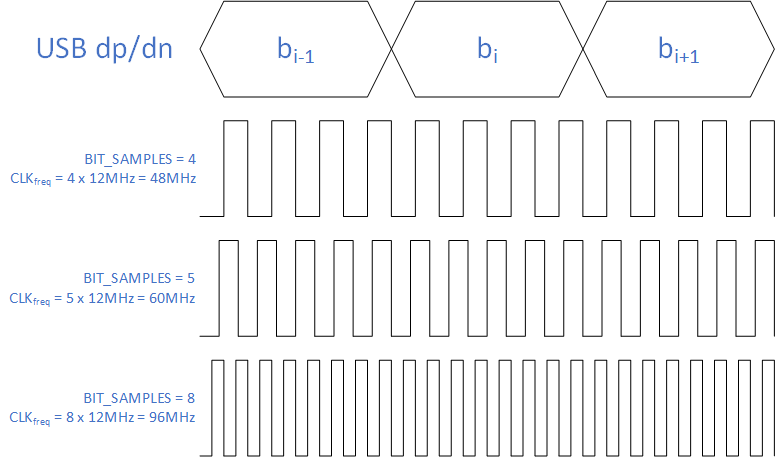

# USB\_CDC verilog module

USB\_CDC is a Verilog implementation of the Full Speed (12Mbit/s) USB communications device class (or USB CDC class). It implements the Abstract Control Model (ACM) subclass.

Windows 10 provides a built-in driver (Usbser.sys) for USB CDC devices.
A USB\_CDC device is automatically recognized by Windows 10 as a virtual COM port, and a serial port terminal application such as [CoolTerm](https://freeware.the-meiers.org/) can be used to communicate with it.

The USB\_CDC idea was born from the awesome [Luke Valenty's TinyFPGA](https://github.com/tinyfpga/TinyFPGA-BX) board. TinyFPGA uses a ["bit-banged" USB port](https://github.com/tinyfpga/TinyFPGA-Bootloader) implemented in the FPGA fabric for communication with the host PC.
David Williams, with his [TinyFPGA-BX USB serial module](https://github.com/davidthings/tinyfpga_bx_usbserial), changed Luke's code to allow USB communication for FPGA designs.
David's code uses the same clock for both USB internal stuff and data interface with FPGA application designs.
Instead, USB\_CDC aims to use a different asynchronous clock to allow a lower frequency clock for FPGA application designs.
Furthermore, USB\_CDC was designed from scratch to keep FPGA resource utilization at the minimum and without the use of EBR memories.

## Block Diagram


## FIFO interface
USB\_CDC provides a FIFO interface to transfer data to/from FPGA application. Both `in_*` and `out_*` channels use the same transmission protocol.


Data is consumed on rising `app_clk` when both `valid` and `ready` signals are high (red up arrows on the picture). The `valid` signal is high only when new data is available. After data is consumed and there is no new data available, the `valid` signal is asserted low.


## Verilog Configuration Parameters
USB\_CDC has few Verilog parameters that allow customizing some module features.

### VENDORID and PRODUCTID
VENDORID and PRODUCTID define USB vendor ID (VID) and product ID (PID). For TinyFPGA, these are 0x1D50 and 0x6130. By default, they are not defined (VENDORID=0x0000 and PRODUCTID=0x0000).

### IN\_BULK\_MAXPACKETSIZE and OUT\_BULK\_MAXPACKETSIZE
IN\_BULK\_MAXPACKETSIZE and OUT\_BULK\_MAXPACKETSIZE define maximum bulk data payload sizes for IN and OUT bulk transactions. The allowable full-speed values are only 8, 16, 32, and 64 bytes. The default value for both is 8.

### BIT\_SAMPLES
BIT\_SAMPLES defines the number of samples taken on USB dp/dn lines for each bit. Full Speed USB has a bit rate of 12MHz, so the `clk` clock has to be BIT\_SAMPLES times faster. For example, the default value of 4 needs a `clk` frequency of 48MHz (see the picture below).



### USE\_APP\_CLK and APP\_CLK\_RATIO
`app_clk` is the FPGA application clock. It can be the same as USB internal stuff (USE\_APP\_CLK = 0) or can be a different asynchronous one (USE\_APP\_CLK = 1). If `app_clk` is asynchronous with `clk`, then for proper synchronization, it must have a frequency less or equal to CLK<sub>freq</sub>/4 (APP\_CLK\_RATIO &ge; 4).
If APP\_CLK\_RATIO is greater than or equal to 8, then USB data is exchanged with FPGA design at each `app_clk` cycle. Otherwise, if 4 &le; APP\_CLK\_RATIO &lt; 8, then USB data is exchanged every 2 `app_clk` cycles.
 
## Logic Resource Utilization

The USB\_CDC code alone (with IN/OUT data in simple loopback configuration and all verilog parameters to default but USE\_APP\_CLK = 1) shows the following logic resource utilization from iCecube2:

```
Logic Resource Utilization:
---------------------------
    Total Logic Cells: 1141/7680
        Combinational Logic Cells: 744      out of   7680      9.6875%
        Sequential Logic Cells:    397      out of   7680      5.16927%
        Logic Tiles:               243      out of   960       25.3125%
    Registers: 
        Logic Registers:           397      out of   7680      5.16927%
        IO Registers:              0        out of   1280      0
    Block RAMs:                    0        out of   32        0%
    Warm Boots:                    0        out of   1         0%
    Pins:
        Input Pins:                1        out of   63        1.5873%
        Output Pins:               2        out of   63        3.1746%
        InOut Pins:                2        out of   63        3.1746%
    Global Buffers:                7        out of   8         87.5%
    PLLs:                          1        out of   1         100%
```

The clock timing summary is:

```
                   1::Clock Frequency Summary
 =====================================================================
Number of clocks: 2
Clock: clk               | Frequency: 69.50 MHz   | Target: 48.39 MHz  | 
Clock: clk_app           | Frequency: 223.54 MHz  | Target: 12.50 MHz  | 
```

## Directory Structure

```
.
├── README.md                          --> This file
├── usb_cdc                            --> USB_CDC verilog files
│   ├── bulk_endp.v
│   ├── ctrl_endp.v
│   ├── phy_rx.v
│   ├── phy_tx.v
│   ├── sie.v
│   └── usb_cdc.v
└── TinyFPGA-BX                        --> Example designs
    ├── hdl
    │   ├── demo
    │   │   ├── TinyFPGA_BX_fpga.vhd   --> Top level (VHDL)
    │   │   ├── TinyFPGA_BX.v          --> Top level (verilog)
    │   │   :
    │   │
    │   └── loopback
    │       ├── loopback.v             --> Top level (verilog)
    │       :
    │
    ├── iCecube2                       --> iCecube2 projects
    │   ├── demo
    │   │   ├── usb_cdc_sbt.project    --> iCecube2 project file
    │   │   :
    │   │
    │   └── loopback
    │       ├── usb_cdc_sbt.project    --> iCecube2 project file
    │       :
    │
    ├── OSS_CAD_Suite                  --> OSS CAD Suite projects
    │   ├── Makefile
    │   ├── input
    │   │   ├── demo
    │   │   │   :
    │   │   └── loopback
    │   │       :
    │   │
    │   └── output
    │       :
    │
    └── python                         --> test files
        └── demo
            ├── run.py
            :
```
